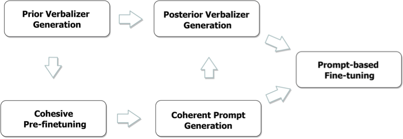

## DesPrompt

This reposity contains the source code and data for the paper *DesPrompt: Personality-descriptive prompt tuning for few-shot personality recognition*





#### Source Code:

Following the workflow above, we generate the prior verbalizers (words and their corresponding weights) by `src/label_words/Prior Verbalizer Generation.ipynb`;

Then, we Pre-finetuning the T5 models by `src/Cohesive Pre-finetuning.ipynb`;

Then, in Coherent Prompt Generation, we generate the templates through `src/Coherent_Prompt_Generation.ipynb`;
(This step is quite time-consuming, so, we also provided the templates we generated in `src/templates/`)

Then, we generate the Posterior Verbaliser through `src/Posterior Verbalizer Generation.ipynb`;

Finally, we conduct the Prompt-based fine-tuning through `src/main.py`


#### Single Sample API:

We also provide a code to inference the personality of an input single sentence with our method: `/src/single_sample_api.py`.

You can modify the input sentence at `line 92`.


#### Required packages:

`pytorch==1.13.0`

`transformers==4.23.1`

`openprompt==1.0.1`

`jupyer notebook==6.4.12`


#### Citation

If the code helps you, please kindly cite the following paper:

```bib
@article{wen2023desprompt,
  title={DesPrompt: Personality-descriptive prompt tuning for few-shot personality recognition},
  author={Wen, Zhiyuan and Cao, Jiannong and Yang, Yu and Wang, Haoli and Yang, Ruosong and Liu, Shuaiqi},
  journal={Information Processing \& Management},
  volume={60},
  number={5},
  pages={103422},
  year={2023},
  publisher={Elsevier}
}

```